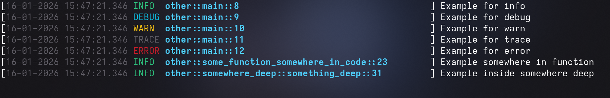

# rust-custom-logging-template

# Rust Log Template

A simple logger template for Rust using the `env_logger` crate.

## Dependencies

- `log`
- `chrono`
- `env_logger`

## Log Format

`[{DATE} {TIME} {LEVEL} {LOCATION (module::path_to_function::line)}] Your text`

every field is alligned with spaces, LOCATION is 50 symbols wide, but nothing stops you from adjusting anything as you like
